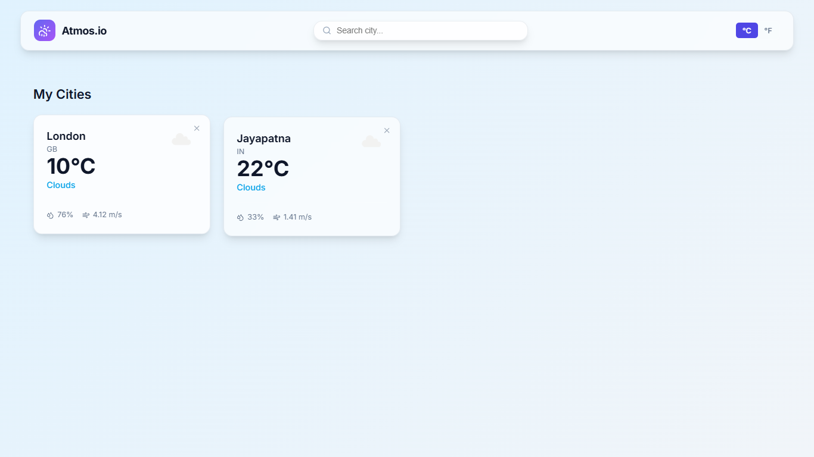
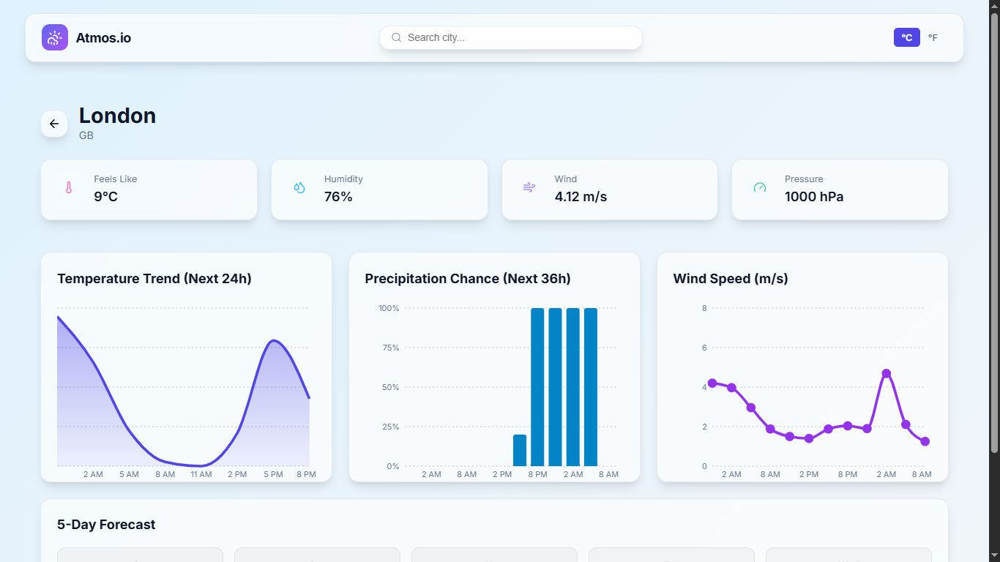

# Atmos.io - Weather Dashboard

### 🚀 Live Demo  
**Atmos.io:** https://sambit-weather-app.vercel.app/

## 🌤️ Overview
Atmos.io is a modern, feature-rich weather dashboard tailored to provide detailed atmospheric data. It offers real-time weather updates, comprehensive forecasts, and analytical visualizations for cities globally.

## 📸 Screenshots

### Dashboard Home

### Detailed Forecast

### 5 Days Forecast

### Analytics & Trends
| Temperature Trend | Precipitation Chance |
|:---:|:---:|
|  |  |
